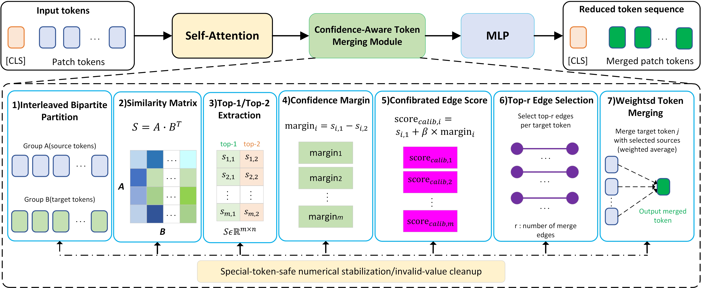

# Confidence-Aware Edge Calibration for Lightweight Token Merging in Vision Transformers



---

## 1. 文件功能总览

| 文件名 | 主要作用 | 是否常用 |
|---|---|---|
| `vit_b_eval.py` | 测试 ViT-B/16 在 `full_native`、`full_patched`、`tome`、`ours` 方法下的 Top-1、Top-5、E2E throughput、model-only throughput | 常用 |
| `vit_l_eval.py` | 测试 ViT-L/16 的 Full、ToMe、Ours，并对 Ours 进行 β 扫描，自动选择最佳 β | 常用 |
| `sweep_etmrl_beta.py` | 调用 `vit_b_eval.py` 对 ViT-B/16 进行 r 和 β 的批量扫描 | 常用 |
| `estimate_flops.py` | 估算 ViT-B/16 在不同 r 下的 GFLOPs、FLOPs Reduction 和 Final Tokens | 常用 |
| `token_merge.py` | 读取单张图片，生成不同 r 下的 token merging 可视化结果 | 常用 |
| `train.py` | 用于简单训练或微调 ViT 模型，不是论文主实验必须脚本 | 可选 |

---

## 2. 数据和权重准备

### 2.1 ImageNet-1K 验证集格式

`vit_b_eval.py` 和 `vit_l_eval.py` 默认使用 ImageNet 文件夹格式：

```text
D:\imagenet-1k\val
├── n01440764
│   ├── xxx.JPEG
│   └── ...
├── n01443537
│   ├── xxx.JPEG
│   └── ...
└── ...
```

每个类别一个文件夹，文件夹名称按字典序排序后作为类别索引。

### 2.2 权重文件

常用权重示例：

```text
ViT-B/16: E:\zp\vision_transformer\vit_base_patch16_224.pth
ViT-L/16: E:\zp\vision_transformer\vit_large_patch16_224.pth
```

如果路径不同，需要在命令参数或脚本配置区中修改。

---

## 3. 使用 `vit_b_eval.py` 测试 ViT-B/16

`vit_b_eval.py` 是 ViT-B/16 的主要评估脚本，支持以下方法：

| method | 含义 |
|---|---|
| `full_native` | 原始 timm ViT，不打 ToMe patch |
| `full_patched` | 打 ToMe patch，但 `r=0`，用于和 ToMe/Ours 公平对比 |
| `tome` | 原始 ToMe token merging |
| `ours` | 本文方法 |
| `all` | 依次测试 `full_native`、`full_patched`、`tome`、`ours` |

### 3.1 测试 Full patched

```powershell
python vit_b_eval.py ^
  --method full_patched ^
  --data-path D:\imagenet-1k\val ^
  --weights E:\zp\vision_transformer\vit_base_patch16_224.pth ^
  --model-name vit_base_patch16_224 ^
  --num-classes 1000 ^
  --batch-size 64 ^
  --num-workers 6 ^
  --device cuda:0 ^
  --preprocess inception ^
  --benchmark-warmup 50 ^
  --benchmark-runs 200 ^
  --benchmark-repeats 5 ^
  --prop-attn
```

作用：测试打 patch 但不合并 token 的 ViT-B/16 基线性能。

### 3.2 测试原始 ToMe

```powershell
python vit_b_eval.py ^
  --method tome ^
  --r 8 ^
  --data-path D:\imagenet-1k\val ^
  --weights E:\zp\vision_transformer\vit_base_patch16_224.pth ^
  --model-name vit_base_patch16_224 ^
  --num-classes 1000 ^
  --batch-size 64 ^
  --num-workers 6 ^
  --device cuda:0 ^
  --preprocess inception ^
  --benchmark-warmup 50 ^
  --benchmark-runs 200 ^
  --benchmark-repeats 5 ^
  --prop-attn
```

作用：测试 ViT-B/16 在原始 ToMe、`r=8` 下的精度和吞吐量。

### 3.3 测试本文方法 Ours

```powershell
python vit_b_eval.py ^
  --method ours ^
  --r 8 ^
  --data-path D:\imagenet-1k\val ^
  --weights E:\zp\vision_transformer\vit_base_patch16_224.pth ^
  --model-name vit_base_patch16_224 ^
  --num-classes 1000 ^
  --batch-size 64 ^
  --num-workers 6 ^
  --device cuda:0 ^
  --preprocess inception ^
  --benchmark-warmup 50 ^
  --benchmark-runs 200 ^
  --benchmark-repeats 5 ^
  --prop-attn
```

作用：测试 ViT-B/16 在本文方法、`r=8` 下的性能。

### 3.4 一次性测试所有方法

```powershell
python vit_b_eval.py ^
  --method all ^
  --r 8 ^
  --data-path D:\imagenet-1k\val ^
  --weights E:\zp\vision_transformer\vit_base_patch16_224.pth ^
  --model-name vit_base_patch16_224 ^
  --num-classes 1000 ^
  --batch-size 64 ^
  --num-workers 6 ^
  --device cuda:0 ^
  --preprocess inception ^
  --benchmark-warmup 50 ^
  --benchmark-runs 200 ^
  --benchmark-repeats 5 ^
  --prop-attn
```

作用：分别启动子进程测试 `full_native`、`full_patched`、`tome`、`ours`，避免同一进程连续测试导致缓存影响。

### 3.5 只测试 model-only throughput

```powershell
python vit_b_eval.py ^
  --method ours ^
  --r 12 ^
  --data-path D:\imagenet-1k\val ^
  --weights E:\zp\vision_transformer\vit_base_patch16_224.pth ^
  --model-name vit_base_patch16_224 ^
  --batch-size 64 ^
  --device cuda:0 ^
  --skip-eval ^
  --prop-attn
```

作用：跳过 ImageNet 验证集精度测试，只测模型前向吞吐量。

---

## 4. 使用 `sweep_etmrl_beta.py` 扫描 ViT-B/16 的 β

`sweep_etmrl_beta.py` 会循环调用 `vit_b_eval.py`，对多个 `r` 和多个 `β` 组合进行测试，并将结果写入 CSV。

默认扫描：

```text
r = 4, 8, 12, 16, 20, 25
β = 0.000, 0.005, ..., 0.070
```

### 4.1 运行 β 扫描

```powershell
python sweep_etmrl_beta.py ^
  --eval-script vit_b_eval.py ^
  --data-path D:\imagenet-1k\val ^
  --weights E:\zp\vision_transformer\vit_base_patch16_224.pth ^
  --model-name vit_base_patch16_224 ^
  --batch-size 64 ^
  --num-workers 6 ^
  --device cuda:0 ^
  --preprocess inception ^
  --lambda-spatial 0.01 ^
  --benchmark-warmup 80 ^
  --benchmark-runs 300 ^
  --benchmark-repeats 3 ^
  --output sweep_etmrl_beta_results.csv
```

作用：扫描不同 `r` 和 `β` 下的 ViT-B/16 Ours 性能，保存到 `sweep_etmrl_beta_results.csv`。

### 4.2 断点续跑

```powershell
python sweep_etmrl_beta.py ^
  --eval-script vit_b_eval.py ^
  --data-path D:\imagenet-1k\val ^
  --weights E:\zp\vision_transformer\vit_base_patch16_224.pth ^
  --output sweep_etmrl_beta_results.csv ^
  --skip-existing
```

作用：如果 CSV 中已经存在某个 `r` 和 `β` 的结果，则自动跳过，适合中断后继续运行。

---

## 5. 使用 `vit_l_eval.py` 测试 ViT-L/16

`vit_l_eval.py` 主要用于 ViT-L/16 的实验。该脚本不是命令行参数模式，而是需要直接修改脚本开头的 `USER CONFIG` 区域。

### 5.1 需要修改的配置

在 `vit_l_eval.py` 开头修改：

```python
VAL_DIR = r"D:\imagenet-1k\val"
WEIGHTS_PATH = r"E:\zp\vision_transformer\vit_large_patch16_224.pth"

MODEL_NAME = "vit_large_patch16_224"
BACKBONE_NAME = "ViT-L/16"
NUM_CLASSES = 1000

DEVICE = "cuda:0"

R_LIST = [0, 4, 8, 12]
BETA_LIST = [
    0.000, 0.005, 0.010, 0.015, 0.020,
    0.025, 0.030, 0.035, 0.040, 0.045,
    0.050, 0.055, 0.060, 0.065, 0.070,
]

BATCH_SIZE = 64
NUM_WORKERS = 6

OUT_DIR = r"E:\zp\vision_transformer\vit_l_results"
```

作用说明：

- `VAL_DIR`：ImageNet-1K 验证集路径；
- `WEIGHTS_PATH`：ViT-L/16 ImageNet-1K 权重路径；
- `R_LIST`：测试的 r 值，ViT-L 推荐只测到 `r=12`；
- `BETA_LIST`：Ours 的 β 扫描范围；
- `OUT_DIR`：结果 CSV 保存目录。

### 5.2 运行 ViT-L 实验

```powershell
python vit_l_eval.py
```

作用：自动完成三部分实验：

1. 测试 Full；
2. 测试每个 r 下的 ToMe；
3. 扫描每个 r 下的 Ours β，并选择最佳 β；
4. 输出最终主结果表。

### 5.3 输出文件

运行后会生成：

```text
E:\zp\vision_transformer\vit_l_results\vit_l_beta_scan_results.csv
E:\zp\vision_transformer\vit_l_results\vit_l_main_results_best_beta.csv
```

其中：

- `vit_l_beta_scan_results.csv`：完整 β 扫描结果；
- `vit_l_main_results_best_beta.csv`：每个 r 下 ToMe 与 Ours-best 的主结果。

---

## 6. 使用 `estimate_flops.py` 估算 ViT-B/16 FLOPs

`estimate_flops.py` 用于估算 ViT-B/16 在不同 r 下的 GFLOPs、FLOPs reduction 和 Final Tokens。

### 6.1 默认运行

```powershell
python estimate_flops.py
```

作用：默认计算：

```text
r = 4, 8, 12, 16, 20, 25
```

并输出 `flops_results.csv`。

### 6.2 指定 r 列表

```powershell
python estimate_flops.py ^
  --r-list 8,12,16 ^
  --output flops_results_r8_r12_r16.csv
```

作用：只计算 `r=8,12,16` 的 FLOPs。

### 6.3 打印逐层 token schedule

```powershell
python estimate_flops.py ^
  --r-list 20,25 ^
  --print-schedule
```

作用：查看每一层的输入 token 数、实际合并 token 数、输出 token 数，适合分析高 r 下为什么精度严重下降。

### 6.4 修改模型配置

如果只用于 ViT-B/16，默认参数不用改。默认配置为：

```text
image-size = 224
patch-size = 16
embed-dim = 768
depth = 12
num-classes = 1000
```

---

## 7. 使用 `token_merge.py` 生成 token merging 可视化

`token_merge.py` 用于对单张图片生成不同 r 下的 token merging 可视化图片。

该脚本需要直接修改开头 `USER CONFIG` 区域。

### 7.1 修改配置

```python
IMAGE_PATH = r"E:\zp\vision_transformer\images\1.JPEG"
WEIGHTS_PATH = r"E:\zp\vision_transformer\vit_base_patch16_224.pth"

MODEL_NAME = "vit_base_patch16_224"
NUM_CLASSES = 1000

R_LIST = [0, 4, 8, 12, 16]

OUT_DIR = r"E:\zp\vision_transformer\token_merge_vis"
DEVICE = "cuda:0"

IMAGE_SIZE = 224
PATCH_SIZE = 16
ALPHA = 1
```

作用说明：

- `IMAGE_PATH`：输入图片路径；
- `WEIGHTS_PATH`：ViT-B/16 权重路径；
- `R_LIST`：需要可视化的 r 值；
- `OUT_DIR`：输出图片目录；
- `ALPHA`：可视化融合强度，越大越接近 token group 效果。

### 7.2 运行可视化

```powershell
python token_merge.py
```

作用：生成原图 crop、每个 r 的 token merging 可视化图，以及横向拼接图。

### 7.3 输出文件

默认输出到：

```text
E:\zp\vision_transformer\token_merge_vis
```

主要文件包括：

```text
original_crop.png
token_merge_r0.png
token_merge_r4.png
token_merge_r8.png
token_merge_r12.png
token_merge_r16.png
token_merge_panel.png
```

其中：

- `token_merge_r*.png`：单个 r 的可视化结果；
- `token_merge_panel.png`：原图和多个 r 的横向拼接图，适合放论文中。

---

## 8. 使用 `train.py` 训练或微调模型

`train.py` 是训练脚本，不是论文主实验必须脚本。它适合用于简单数据集或小规模微调实验。

### 8.1 默认运行

```powershell
python train.py
```

默认配置通常是 flower 数据集和 ViT-B/16 ImageNet-21K 权重，需要根据你的实际路径修改。

### 8.2 常用参数

```powershell
python train.py ^
  --num_classes 5 ^
  --epochs 5 ^
  --batch-size 64 ^
  --lr 0.001 ^
  --data-path E:\zp\vision_transformer\flower_photos\flower_photos ^
  --model-name vit_base_patch16_224_in21k ^
  --weights E:\zp\vision_transformer\jx_vit_base_patch16_224_in21k-e5005f0a.pth ^
  --freeze-layers True ^
  --device cuda:0 ^
  --r 0
```

参数说明：

- `--num_classes`：分类类别数；
- `--epochs`：训练轮数；
- `--data-path`：数据集根目录；
- `--weights`：预训练权重路径；
- `--freeze-layers`：是否冻结 backbone，仅训练 head；
- `--r`：每层 token merging 数量。

---

## 9. 推荐实验顺序

### 9.1 ViT-B/16 主实验

```text
1. vit_b_eval.py 测 full_patched
2. vit_b_eval.py 测 ToMe r=8,12,16
3. sweep_etmrl_beta.py 扫描 Ours 的 β
4. estimate_flops.py 计算 GFLOPs 和 Final Tokens
5. token_merge.py 生成可视化图片
```

### 9.2 ViT-L/16 扩展实验

```text
1. 修改 vit_l_eval.py 的 USER CONFIG
2. 运行 python vit_l_eval.py
3. 使用 vit_l_main_results_best_beta.csv 作为 ViT-L 主结果
```

---

## 10. 常见注意事项

### 10.1 ViT-L 不建议测试过大的 r

ViT-L/16 层数更多，固定每层合并 `r` 会更快压缩 token 数。建议只测试：

```text
r = 0, 4, 8, 12
```

其中 `r=12` 已经是极端压缩案例。

### 10.2 论文中建议使用 model-only throughput

`vit_b_eval.py` 和 `vit_l_eval.py` 都会输出：

```text
E2E throughput
Model-only throughput mean
Model-only throughput median
```

论文表格中建议使用：

```text
Model-only throughput median
```

因为它不包含 DataLoader、PIL 解码和预处理开销，更适合比较模型本身速度。

### 10.3 ToMe 和 Ours 的 GFLOPs 相同

在同一个 `r` 下，ToMe 和 Ours 的 token schedule 相同，所以估算 GFLOPs 相同。二者实际速度差异主要来自 Ours 额外的 top-1/top-2 margin、数值稳定和排序处理开销。

